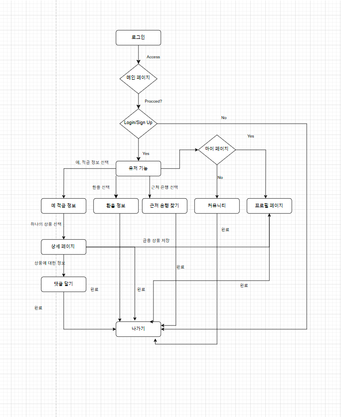
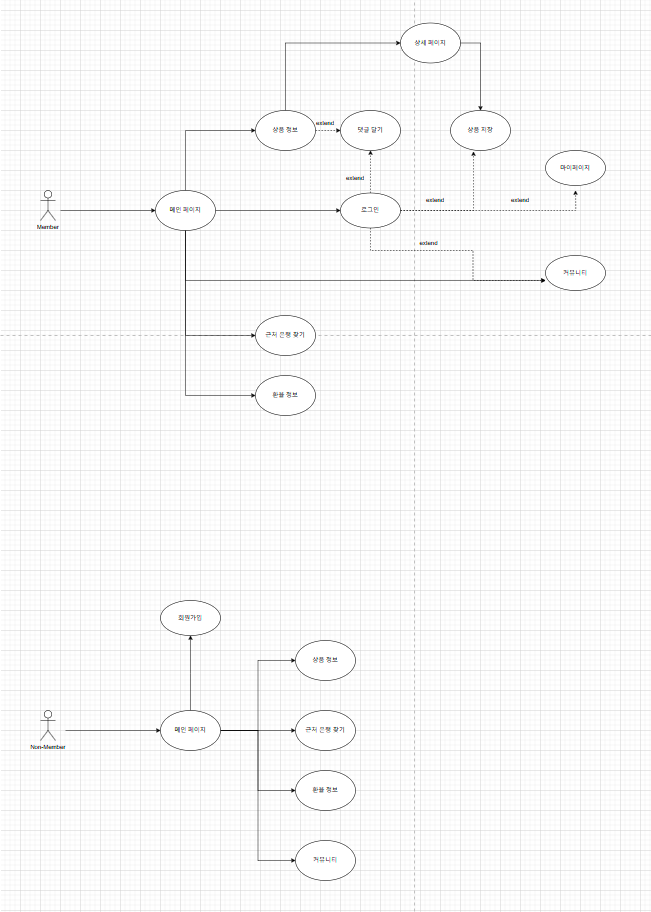
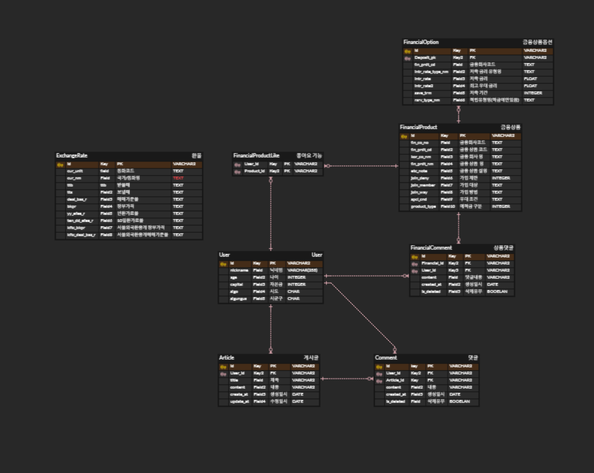

# 싸피 12기 1학기 Final 관통 Project

## 프로젝트 소개

"SSAFY 12기 관통 파이널 프로젝트 이며, 주제는 금융상품 추천 어플리케이션 입니다. Back-end 기술은 Python, Django, SQLite, Front-end 기술은 Vue, JS 입니다.
주요 기능으로는

- 금융 상품 추천
  - 예, 적금 상품 추천
  - 주식 상품 추천
  - 코인 상품 추천
- 각 상품에 대한 게시글
  - 유저 별로, 각 상품에 대한 코멘트 작성이 가능합니다.
- 유저 게시판
  - 유저 별로, 각 상품에 대한 의견을 나눌 수 있는 게시판입니다.
  - 게시판에는 유저 별로, 코멘트 작성이 가능합니다.

### 주요 기능

1. 로그인, 로그아웃 기능
2. 회원가입 기능
3. 예적금 데이터 (최소 50개 이상)
4. 예적금 상품 조회
5. 예적금 상세 목록 조회
6. 커뮤니티 게시글 기능
7. 커뮤니티 댓글 기능
8. 좋아요 기능 환율 계산 기능
9. 프로필 기능
10. 은행 검색 기능
11. 금융 상품 추천 알고리즘
12. AI 추천 / 검색 서비스 기능
13. 암호화폐 페이지
14. 상품 그래프 기능

## 사용 기술

---

### BackEnd

- Django
- Python
- SQLite

### FrontEnd

- JavaScript
- Vue.js
- HTML/CSS

### 서비스 설계

<details>
<summary>FlowChart, UseCaseDiagram</summary>




</details>

<details>
<summary>ERD</summary>



</details>

<details>
<summary>API 명세서</summary>

### Sign Up

`POST /accounts/signup/`

| Field     | Type    | Required | Description          |
| --------- | ------- | -------- | -------------------- |
| username  | string  | Yes      | 사용자 아이디        |
| email     | string  | Yes      | 이메일 주소          |
| password1 | string  | Yes      | 비밀번호             |
| password2 | string  | Yes      | 비밀번호 확인        |
| age       | integer | No       | 나이                 |
| capital   | integer | No       | 자본금               |
| nickname  | string  | No       | 닉네임 (최대 10자)   |
| sido      | string  | No       | 시/도 (최대 10자)    |
| sigungus  | string  | No       | 시/군/구 (최대 10자) |

### List Articles

`GET /articles/`

**Response:**
| Field | Type | Description |
|-------|------|-------------|
| id | integer | 게시글 ID |
| title | string | 제목 |
| content | string | 내용 |
| create_at | datetime | 작성일 |
| update_at | datetime | 수정일 |
| users | string | 작성자 |

### Create Article

`POST /articles/create/`

**Request Body:**
| Field | Type | Required | Description |
|-------|------|----------|-------------|
| title | string | Yes | 제목 |
| content | string | Yes | 내용 |

### Article Detail

`GET /articles/<article_pk>/`

**Response:**
| Field | Type | Description |
|-------|------|-------------|
| id | integer | 게시글 ID |
| title | string | 제목 |
| content | string | 내용 |
| users | integer | 작성자 ID |
| create_at | datetime | 작성일 |
| update_at | datetime | 수정일 |
| nickname | string | 작성자 닉네임 |
| comments | array | 댓글 목록 |
| comments_count | integer | 댓글 수 |

### List Products with Options

`GET /financials/financial-products-with-options/`

**Response:**
| Field | Type | Description |
|-------|------|-------------|
| id | integer | 상품 ID |
| options | array | 금융 상품 옵션 목록 |
| fin_product_cd | string | 상품 코드 |
| kor_co_nm | string | 금융사 이름 |
| fin_product_nm | string | 상품명 |

### Financial Comment

`POST /financials/financial-comment_create/<fin_product_pk>/`

**Request Body:**
| Field | Type | Required | Description |
|-------|------|----------|-------------|
| content | string | Yes | 댓글 내용 |

### Exchange Rate

`GET /financials/exchange-rate/`

**Response:**
| Field | Type | Description |
|-------|------|-------------|
| id | integer | 환율 정보 ID |
| cur_unit | string | 통화 단위 |
| cur_nm | string | 통화명 |
| deal_bas_r | string | 매매기준율 |
| bkpr | string | 장부가격 |

</details>

<details>
<summary>컴포넌트 구조도</summary>

```
src/
├── components/
│   ├── Layout/
│   │   ├── NavBar.vue              # 상단 네비게이션 바 컴포넌트
│   │   ├── Footer.vue              # 하단 푸터 컴포넌트
│   │   └── MiddleNav.vue           # 중앙 네비게이션 메뉴 컴포넌트
│   │
│   ├── Financial/
│   │   ├── MainProductList.vue     # 메인 페이지 상품 목록 컴포넌트
│   │   ├── FinProductTable.vue     # 금융 상품 테이블 컴포넌트
│   │   ├── SavingProductTable.vue  # 적금 상품 테이블 컴포넌트
│   │   ├── MainPageBank.vue        # 메인 페이지 은행 정보 컴포넌트
│   │   ├── ProductComments.vue     # 상품 댓글 컴포넌트
│   │   ├── ProductWithOptions.vue  # 상품 옵션 표시 컴포넌트
│   │   └── BankMap.vue            # 은행 지도 표시 컴포넌트
│   │
│   ├── Exchange/
│   │   ├── ExchangeCalculator.vue  # 환율 계산기 컴포넌트
│   │   ├── ExchangeDetail.vue      # 환율 상세 정보 컴포넌트
│   │   ├── ExchangeItem.vue        # 환율 아이템 컴포넌트
│   │   └── ExchangeList.vue        # 환율 목록 컴포넌트
│   │
│   ├── Recommend/
│   │   ├── RecommendDetailProduct.vue   # 추천 상품 상세 컴포넌트
│   │   ├── RecommendDeposit.vue         # 예금 상품 추천 컴포넌트
│   │   └── RecommendSaving.vue          # 적금 상품 추천 컴포넌트
│   │
│   ├── Community/
│   │   └── CommunityComment.vue    # 커뮤니티 댓글 컴포넌트
│   │
│   ├── Auth/
│   │   └── LoginModal.vue          # 로그인 모달 컴포넌트
│   │
│   ├── Carousel/
│   │   └── MainPageCarousel.vue    # 메인 페이지 캐러셀 컴포넌트
│   │
│   ├── Crypto/
│   │   └── CryptoCard.vue          # 암호화폐 카드 컴포넌트
│   │
│   └── Util/
│       ├── Calculator.vue          # 계산기 유틸리티 컴포넌트
│       └── ChatbotWidget.vue       # 챗봇 위젯 컴포넌트
│
└── views/
    ├── MainView.vue                # 메인 페이지 뷰
    ├── FinView.vue                 # 금융 상품 페이지 뷰
    ├── ProductDetailView.vue       # 상품 상세 페이지 뷰
    ├── ExchangeView.vue            # 환율 페이지 뷰
    ├── CryptoView.vue              # 암호화폐 페이지 뷰
    ├── CommunityView.vue           # 커뮤니티 목록 페이지 뷰
    ├── CommunityDetailView.vue     # 커뮤니티 상세 페이지 뷰
    ├── CreateArticleView.vue       # 게시글 작성 페이지 뷰
    ├── ProfileView.vue             # 프로필 페이지 뷰
    └── SignUpView.vue              # 회원가입 페이지 뷰
```

## 디렉토리 구조 설명

### components/

- **Layout/**: 페이지 레이아웃 관련 컴포넌트
- **Financial/**: 금융 상품 관련 컴포넌트
- **Exchange/**: 환율 관련 컴포넌트
- **Recommend/**: 상품 추천 관련 컴포넌트
- **Community/**: 커뮤니티 관련 컴포넌트
- **Auth/**: 인증 관련 컴포넌트
- **Carousel/**: 캐러셀 관련 컴포넌트
- **Crypto/**: 암호화폐 관련 컴포넌트
- **Util/**: 유틸리티 컴포넌트

### views/

- 각 페이지의 최상위 뷰 컴포넌트들
- 라우팅의 진입점이 되는 페이지 컴포넌트들

</details>

<details>
<summary>피그마 링크</summary>

- [CashFit 피그마 디자인](https://www.figma.com/design/X24paozkyo2SOSLZBrvUIY/SSAFY-Final-Prj?node-id=0-1&node-type=canvas&t=QPWFJynNVlfP8EYA-0)

</details>

### 개발기간

- 2024.11.04(월) ~ 2024.11.29(금)
- 업무 분장
- ERD 작성
- API 데이터 준비
- API, ERD에 맞게 Model 관계 설정
- 웹 디자인 작성
- BackEnd 로직 작성
- FrontEnd - BackEnd 통신 및 연결
- 병합
- 발표 및 평가

### 팀원 소개

- **김병년** : 조장, FullStack, Front-end 전체 담당 깃 주소 : https://github.com/KimByeongNyeon/
- **이용재** : FullStack, Back-end 전체 담당 깃 주소 : https://github.com/yongjae730/

### 업무 분담

| 주요기능                   | 담당자                      |
| -------------------------- | --------------------------- |
| 로그인, 로그아웃 기능      | 김병년(front), 이용재(back) |
| 회원가입 기능              | 김병년(front), 이용재(back) |
| 예적금 데이터              | 이용재(back)                |
| 예적금 상품 조회           | 김병년(front), 이용재(back) |
| 예적금 상세 목록 조회      | 김병년(front), 이용재(back) |
| 상품 그래프 기능           | 김병년(front)               |
| 커뮤니티 게시글 기능       | 김병년(front), 이용재(back) |
| 커뮤니티 댓글 기능         | 김병년(front), 이용재(back) |
| 좋아요 기능                | 김병년(front), 이용재(back) |
| 환율 계산 기능             | 김병년(front), 이용재(back) |
| 프로필 기능                | 김병년(front), 이용재(back) |
| 은행 검색 기능             | 김병년(back, front)         |
| 금융 상품 추천 알고리즘    | 김병년(front), 이용재(back) |
| AI 추천 / 검색 서비스 기능 | 이용재(back, front)         |
| 암호화폐 페이지            | 김병년(back, front)         |
| UI / UX                    | 김병년, 이용재              |

### 참고 사항

---

#### API 링크

- 금감원 API
  - 예금 : https://finlife.fss.or.kr/finlife/api/fncCoApi/list.do?menuNo=700052
  - 적금 : https://finlife.fss.or.kr/finlife/api/fdrmEntyApi/list.do?menuNo=700053
- 한국 수출입 은행 환율정보
  - https://www.koreaexim.go.kr/ir/HPHKIR020M01?apino=2&viewtype=C&searchselect=&searchword=
- ## 코인 API
  - https://api.upbit.com/v1/market/all
  - https://api.upbit.com/v1/candles/minutes/
  - wss://api.upbit.com/websocket/v1/

#### ERD-Cloud 링크

- https://www.erdcloud.com/d/GdKjjLXs9QvhQZvWz

### 후기

김병년 : 프로젝트 시작 전에 페어를 용재형이랑 하기로 하면서 먼저, 방향성을 완전하게 백, 프론트로 구분하기로 해서 진행했었고, 실제로 코드 작성 시에도 겹치는 부분이 없어서, 단 한번의 충돌 없이 수월하게 프로젝트를 진행했던 것 같습니다. 이번 프로젝트를 하면서, 지금까지 진행했던 프로젝트와는 달리 뭔가 제대로된 기능, 역할의 분리가 된 것 같아서 재밌게 진행했던 것 같고, 프론트엔드 개발자를 희망하는 저로서는 프론트엔드 전반적인 부분을 담당한 것이 제 스스로 성장할 수 있는 계기도 같이 제공 되기도 했고, 실제로 로직을 구성하면서, async, await 와 같은 순서가 보장된 비동기 처리와 같은 기술, 암호화폐 페이지 개발 시에 사용한 WebSocket 기술 등, 여러 가지 기술을 녹여낼 수 있을 만큼 녹여냈다고 생각했고, 더 배울 부분이 많이 남아있다고 느껴졌습니다.

아쉬웠던 점은, 로직은 금방금방 구성해서 실제 기능에 대한 코딩 시간은 크게 할애하지 않았지만, 자잘한 버그를 잡는 것이 어려웠고, 제가 작성한 코드가 불완전한 코드였다는 것을 다시 알게 되었습니다. 또한, UI/UX 구성 하는 것이 좀 어려웠습니다..

이용재 : 프로젝트를 시작 할 때 2학기를 고려했을 때 백을 할 기회가 많이 없을것 같아 관통때는 한번 해보자! 라는 생각으로 백엔드를 잡았는데 API를 사용한 model을 구성하니 생각보다 ERD가 간단하게 나와 진행 시에 DB에 대한 걱정이 생각보다 쉽게 끝나 다행이었습니다. 프로젝트 진행 중 제가 발견못한 오타(s가 빠졌다던가)를 발견하지 못하면 나중에 프론트작업 시 영향이 크게 미친다는것을 알고 백엔드의 중요함을 알았습니다. 로직을 구현하면서 중간중간 필요하다고 생각되는 Serializer들을 필요에 따라 만들고, 프론트에 의견을 물으며 해당 데이터 방식으로 넘기면 더 편한가에 대해 얘기를 하고 구현을 하니 프로젝트를 하면서 많이 배우게 된다고 느꼈습니다. 아쉬웠던 점은 백엔드만으로는 구현한 기능이 제대로 작동되는지, Serializer를 통한 직렬화가 유용하게 이루어졌는지 알기 힘들었다는 것이었습니다. 또한, 기간적 압박으로 인해 생성형 AI의 도움을 받았는데 코드가 제가 쓴 코드가 많이 불안정하였고, Django내부에 아직 잘 모르는것들을 사용하게 되면서 배울게 아직 많이 남았고, 그런것들을 자유롭게 구성하고 싶다는 생각을 했습니다.
